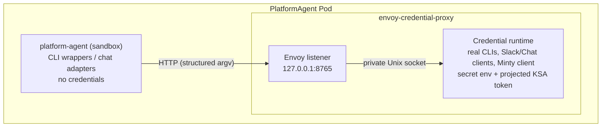

The PlatformAgent sandbox container never receives API keys, access tokens, refresh tokens, or Kubernetes ServiceAccount tokens through its environment or filesystem. Credentials live exclusively in a trusted **Envoy credential-proxy sidecar** inside the same Pod, and the sandbox reaches credentialed capabilities only through a policy-enforced local proxy.

This page summarizes the architecture. The canonical design — including scope, deny-policy details, migration steps, and CI verification assertions — is [`docs/credential-isolation-design.md`](https://github.com/gke-labs/kube-agents/blob/main/docs/credential-isolation-design.md).

## Pod anatomy

Each PlatformAgent runs as one long-lived Pod with these managed containers:

| Container                  | Trust level | Role                                                                 |
| -------------------------- | ----------- | -------------------------------------------------------------------- |
| `platform-agent`           | Untrusted   | The agent sandbox — credential-free env and mounts, CLI wrappers.    |
| `envoy-credential-proxy`   | Trusted     | Envoy plus the credentialed command and chat runtime.                |
| `event-watcher`            | Trusted     | Cluster-event forwarding with its own separate Kubernetes-API token. |
| `fluent-bit`               | Trusted     | Log forwarding.                                                      |
| `platform-agent-dashboard` | Untrusted   | Optional local dashboard (also credential-free).                     |



The sandbox image contains only **wrapper binaries** for `gcloud`, `kubectl`, `gh`, and `git`. A wrapper sends the executable name and argument array to Envoy at `127.0.0.1:8765`; the credential runtime executes the corresponding real CLI and returns output and exit status. It never evaluates an agent-supplied shell command, and the runtime's Unix socket is mounted only in the sidecar, so the sandbox cannot bypass Envoy. The real credential-aware CLIs ship in a separate `credential-proxy` image that the sandbox never runs.

**The sandbox environment does not cross the boundary.** The command runs with an environment the sidecar builds itself, so exporting a variable in the agent shell has no effect on the proxied process. Two values are carried explicitly in the request instead, and both must resolve inside the shared agent workspace or the request is rejected with `400`:

- **Working directory** — so relative paths in `git` and `kubectl` arguments mean what the agent intends.
- **`KUBECONFIG`** — how a Cluster Agent profile pins itself to one target cluster. Without a `KUBECONFIG`, commands use the context the sidecar bootstrapped for the host cluster.

**A kubeconfig names a cluster; it never supplies content.** The pin lives on the shared volume, so it is a document the agent can write — and a kubeconfig is executable configuration, not passive data. Fields such as `users[].user.exec.command`, `clusters[].cluster.server`, and `users[].user.tokenFile` would respectively run a program next to the credentials, redirect the minted access token, and disclose a sidecar file as a bearer token. None of it is visible to the [command policy](#request-paths), whose rules match on the argument array: the argv is only ever `kubectl get pods`. The design doc has the [full enumeration and the reasoning](https://github.com/gke-labs/kube-agents/blob/main/docs/credential-isolation-design.md#agent-supplied-kubeconfigs).

So the sidecar reads exactly one string out of the file the agent wrote, `current-context`, accepts it only if it is a well-formed `gke_<project>_<location>_<cluster>` name, and regenerates the kubeconfig itself with `gcloud container clusters get-credentials` into a directory mounted only in the sidecar. That regenerated file is what every proxied command runs against. The same substitution is applied to a `--kubeconfig` flag, which kubectl prefers over the environment. `get-credentials` is the one command allowed to author a kubeconfig: it writes into the sidecar's own directory and the result is copied out to the workspace afterwards, so the visible pin still exists for the agent to inspect without ever being what a later command opens.

Naming a cluster is not extra authority — `get-credentials` is bound by the same IAM the proxy already runs under, so it can only reach clusters this identity could reach anyway. A pin the proxy cannot regenerate from (no `current-context`, a non-GKE context name, a merged `path1:path2` list) is rejected with `400` rather than honored.

**Tree-mutating `git` runs only inside a leased workspace.** Containment to the shared volume keeps the agent off the sidecar's filesystem; it says nothing about keeping concurrent agents off each other, and a Pod runs five audit crons alongside every kanban worker. A skill takes a lease and works in a private clone under `/opt/data/gitops/<lease>/<owner>__<name>`; the proxy refuses `git add`, `commit`, `checkout`, `push`, `reset` and the other verbs that write a working tree or a remote ref unless the resolved directory — after any `-C` redirect — sits under one holding a `.lease` marker. Read verbs, `fetch`, and `clone` are unaffected. The refusal comes back as `SECURITY_POLICY_BLOCKED` with rule `git.workspace.lease`, and `CREDENTIAL_PROXY_REQUIRE_GIT_LEASE=0` disables the check for an unmigrated skill.

This is a floor, not an ownership check: the wrapper sends an argument array and a working directory, never a caller identity, so the sidecar can tell that a push is happening inside _some_ lease but not whose. Whether the lease is the caller's own is checked in the sandbox by the skill that holds it. [`docs/designs/gitops-workspace-leases.md`](https://github.com/gke-labs/kube-agents/blob/main/docs/designs/gitops-workspace-leases.md) is canonical for the layout and the reaper.

**`kubectl` and `gcloud` are read-only by default.** The proxy enforces that `kubectl` may not run mutating verbs like `delete`, `create`, `patch`, or `rollout restart`, and that `gcloud` may not run commands that change cloud resources. It refuses the flags that would change which identity a command authenticates as or which server receives the credential — `--as`, `--server`, `--token`, `--kuberc`, `--insecure-skip-tls-verify` and their `gcloud` equivalents — and the refusal comes back as `SECURITY_POLICY_BLOCKED` with a rule such as `kubernetes.read-only` or `kubernetes.identity-change-forbidden`.

**This allowlist is currently the only thing enforcing that posture.** There is no second layer beneath it today: a command it fails to refuse runs against the cluster with the sidecar's full credential. Kubernetes impersonation is planned and not yet deployed; once it ships, the API server will authorize each request as the requesting human user and this allowlist becomes the outer of two layers rather than the whole control. Note also that the current deployment shares one Google service account across every agent — that is the gap impersonation closes, not a mitigation.

A first deployment in a live environment will find read-only commands nobody anticipated. The fix is to add the verb to the allowlist in `command_policy.py` and ship it; that keeps the change reviewable and scoped to the one command that was missing. Report the blocked command to your infrastructure team with the rule id from the refusal.

## Credential placement

| Data                            | Sandbox     | Credential sidecar        |
| ------------------------------- | ----------- | ------------------------- |
| `spec.deployment.env`           | No          | Yes                       |
| Slack tokens                    | No          | Yes, Secret-backed env    |
| PlatformAgent external API key  | No          | Yes, Secret-backed env    |
| Automatic KSA token mount       | Disabled    | Disabled                  |
| Explicit projected KSA token    | Not mounted | Read-only, one-hour token |
| gcloud/kubectl configuration    | No          | Private `emptyDir`        |
| GitHub installation token/cache | No          | Private `emptyDir`        |
| Agent workspace                 | Yes         | Yes, for proxied commands |

Pod-wide `automountServiceAccountToken` is `false`. The sidecar's projected token uses the audience `kubeagents-credential-proxy` and expires after one hour; the event watcher gets a separate one-hour Kubernetes-API token projection. Neither token is mounted in the agent or dashboard containers.

## Request paths

- **CLI commands** — only `gcloud`, `kubectl`, `gh`, and `git` are accepted. The proxy rejects known credential-disclosure, credential-replacement, and self-modification operations; interactive TTY programs, unbounded streaming, sandbox-only file paths, and background processes fail closed.
- **Chat** — Slack and Google Chat adapters send credential-free payloads to Envoy; the credential runtime owns the platform tokens and performs the external API calls, enforcing user allowlists and payload limits.
- **PlatformAgent API** — the Service targets port 8643 on the sidecar, which validates the external bearer key and forwards to the sandbox API on loopback (port 8642) with a non-secret sentinel. The real key never enters the sandbox.
- **GitHub** — the sidecar obtains a Google OIDC identity token and calls [Minty](/kube-agents/deploy/token-minter/), which brokers a repository-scoped GitHub App installation token with a maximum one-hour lifetime. The App's private key stays in Cloud KMS.

## Guarantee and limitation

**Guarantee:** the operator does not place managed credentials in the sandbox container's environment, root filesystem, persistent agent volume, or mounted ServiceAccount token path. `spec.deployment.env` is applied to the credential sidecar because it may contain credentials (only four allowlisted OpenTelemetry settings are copied to the sandbox, as literal values only).

**Limitation:** containers in one Pod share a network namespace and one Pod identity. The sandbox has no KSA token file, but it can technically reach the GKE metadata server used by the sidecar — a Pod-level NetworkPolicy cannot block metadata for one container while allowing it for another. The design meets the scoped filesystem-and-environment goal but does not provide the stronger identity boundary of separate Pods.

What the two containers do **not** share is a process namespace or a user. No configuration sets `shareProcessNamespace` — the dashboard-enabled one used to — and the sidecar runs as its own UID, so the sandbox cannot read the sidecar's environment out of `/proc`. [`docs/security-requirements.md`](https://github.com/gke-labs/kube-agents/blob/main/docs/security-requirements.md) tracks both that requirement and the Pod-sharing limitation above formally.

## Splitting the broker into its own Pod

`spec.security.splitCredentialBrokerPod` renders the credential runtime as a Deployment and Service of its own instead of a sidecar. It closes the shared-network-namespace limitation above: with the broker in another Pod, "reachable on `127.0.0.1`" is no longer what decides who may spend the agent's credentials, and a NetworkPolicy can deny the sandbox the metadata server without denying it to the broker.

**It defaults to `false`, and it requires ReadWriteMany storage.** This is the blocker, not a footnote. The broker runs proxied commands with a working directory the agent created on the shared data volume — a leased git clone, a Cluster Agent profile home, a `.kubeconfigs` directory are all written by one process and used by the other. Both Pods therefore have to mount the `<name>-data` claim read-write at the same path and see the same files there. The default GKE persistent disk is ReadWriteOnce and cannot do that across two Pods on different nodes; the cluster needs Filestore or GCS Fuse, and a storage class such as `standard-rwx`, provisioned before the flag is set. The access mode of an existing claim cannot be changed in place, so this means new storage rather than an edit.

**What going without it actually looks like** is a scheduling failure, not a policy refusal. The broker Pod cannot attach the volume, stays `Pending` with a `Multi-Attach error for volume`, and never becomes a Service endpoint — so every proxied command in the sandbox reports `credential proxy unavailable: [Errno 111] Connection refused`. That is the same symptom an unhealthy sidecar produces, which is why [Troubleshooting](#troubleshooting) below now lists both causes. The operator logs a warning naming the claim and its access modes when it sees a non-RWX volume under an enabled flag. Note that the broker's own workspace-containment check will not catch this: it compares paths, both Pods are configured with the same workspace root, so the path always looks correct — what is missing is the data behind it. And if the scheduler happens to place both Pods on one node, it will appear to work, which makes the misconfiguration intermittent across restarts.

When the flag is on:

- The broker becomes `<name>-credential-proxy`, a single-replica Deployment with a Service on 8765. The agent's `CREDENTIAL_PROXY_URL` and the two chat relay URLs address that Service.
- **The call is authenticated.** The agent presents a projected ServiceAccount token with the audience `kubeagents-credential-proxy`; the broker verifies it with a Kubernetes `TokenReview` and refuses anything else with `401`. This is not optional plumbing — the sidecar layout's access control was the loopback listener and a `0600` socket, and both of those are properties of sharing a Pod.
- The front door for the PlatformAgent API stays in the agent Pod as an `agent-api-proxy` container. It forwards to port 8642 on loopback behind a fixed non-secret sentinel, which is only safe because it never leaves the Pod, so it does not follow the broker across the boundary.

Two things it does not do, and both are deliberate:

- **The two Pods share a ServiceAccount.** The Workload Identity IAM binding names it, so giving the agent one of its own would take the broker's cloud credentials with it. The identity the broker verifies is therefore "a Pod running as this ServiceAccount" — enough to exclude the rest of the cluster, not enough to tell the agent Pod from the broker Pod.
- **The token crosses the network in cleartext**, as the [Minty](/kube-agents/deploy/token-minter/) call already does. Anyone who can observe pod-to-pod traffic in the namespace can replay it until it expires. It is audience-bound, so it is useless against the Kubernetes API or any other service, and it is worth at most an hour. mTLS is the fix and is not deployed.

### The agent now holds a credential, and that was a choice

Under the sidecar layout the sandbox holds nothing at all — the broker's trust comes entirely from the socket. With the flag on, the projected token is mounted into the `platform-agent` container itself, so the model can read it. A prompt-injected agent gains no new authority _inside_ the Pod, because it could already call the broker by running `kubectl`. What it gains is **exportability**: the token is a file, and a file can be exfiltrated, after which an outside party has broker access — bounded by the command policy — until the token expires.

Against the credential requirements this mechanism is short-lived, audience-bound and independently revocable, but **not non-exportable**, and that last clause is the one it misses.

**An alternative was considered and deferred.** This same change already contains the pattern that would avoid it: `agent-api-proxy` is a credential-holding container in the agent Pod, on loopback, at a different UID, with no volumes the sandbox can read. A mirror image of it — an egress forwarder in the agent Pod that holds the token, listens on `127.0.0.1:8765`, and attaches the credential on its way out to the broker Service — would keep the wrappers unchanged and preserve "the sandbox holds no credential at all". It is not built here because it is a new component with its own failure modes, lifecycle and review surface, and this change was scoped to the split and its transport. It remains the obvious next step for anyone hardening this, and nothing in the current design forecloses it: the client's `authorization_headers()` would simply return nothing and the forwarder would supply the header instead.

## Troubleshooting

**Every CLI in the sandbox reports `credential proxy unavailable`.** The `gcloud`, `kubectl`, `gh`, and `git` commands inside `platform-agent` are wrappers that forward to the broker. When nothing is listening at the other end, all four fail the same way:

```text
credential proxy unavailable: [Errno 111] Connection refused
```

This is an availability problem rather than an authentication one — a rejected credential comes back as an HTTP error, not a refused connection. There are two causes, and which applies depends on whether the broker is a sidecar or a Pod of its own.

_Sidecar layout (the default)._ The sidecar is not listening. Inspect it rather than the CLI:

```bash
kubectl get pods -n kubeagents-system
kubectl logs -n kubeagents-system deploy/platform-agent-gateway -c envoy-credential-proxy
```

_Split layout (`spec.security.splitCredentialBrokerPod: true`)._ The wrappers cross a Service, so the same message also means the broker Pod has no ready endpoint. The most common reason is the ReadWriteMany prerequisite above being unmet: the Pod cannot attach the shared volume and sits `Pending`. Check the endpoint first and the events second — `Multi-Attach error for volume` is the tell.

```bash
kubectl get endpoints -n kubeagents-system platform-agent-credential-proxy
kubectl describe pod -n kubeagents-system -l app=platform-agent-credential-proxy
kubectl logs -n kubeagents-system deploy/platform-agent-credential-proxy
```

**Diagnostics run inside the Pod are misleading while the sidecar is down.** Those wrappers are the only `gcloud` and `kubectl` the sandbox has, so the commands you would normally reach for return the same connection error instead of describing the Pod's identity. Test that identity from a throwaway Pod using the same ServiceAccount:

```bash
kubectl run wi-check -n kubeagents-system --rm -it --restart=Never \
  --image=google/cloud-sdk:slim \
  --overrides='{"spec":{"serviceAccountName":"kubeagents-platform-agent"}}' \
  -- gcloud auth print-access-token
```

**The sidecar exits during startup.** The credential runtime runs `CREDENTIAL_PROXY_BOOTSTRAP_COMMAND` before it begins serving, and a non-zero exit stops the container — the Pod then crashloops while the other containers stay healthy. The command's stdout and stderr are written to the sidecar's log, so `kubectl logs -c envoy-credential-proxy` carries the reason. Bootstrap failures usually mean the Pod cannot reach the cluster or mint a token; see [Security & IAM](/kube-agents/reference/security-and-iam/) for the Workload Identity binding it depends on.

## Where to go next

- [Security & IAM](/kube-agents/reference/security-and-iam/) — Workload Identity, the GCP permission sets, and the read-only Kubernetes RBAC.
- [Token minter (Minty)](/kube-agents/deploy/token-minter/) — short-lived GitHub App tokens via KMS.
- [Full design doc](https://github.com/gke-labs/kube-agents/blob/main/docs/credential-isolation-design.md) — scope, deny policy, migration, and CI verification assertions.
